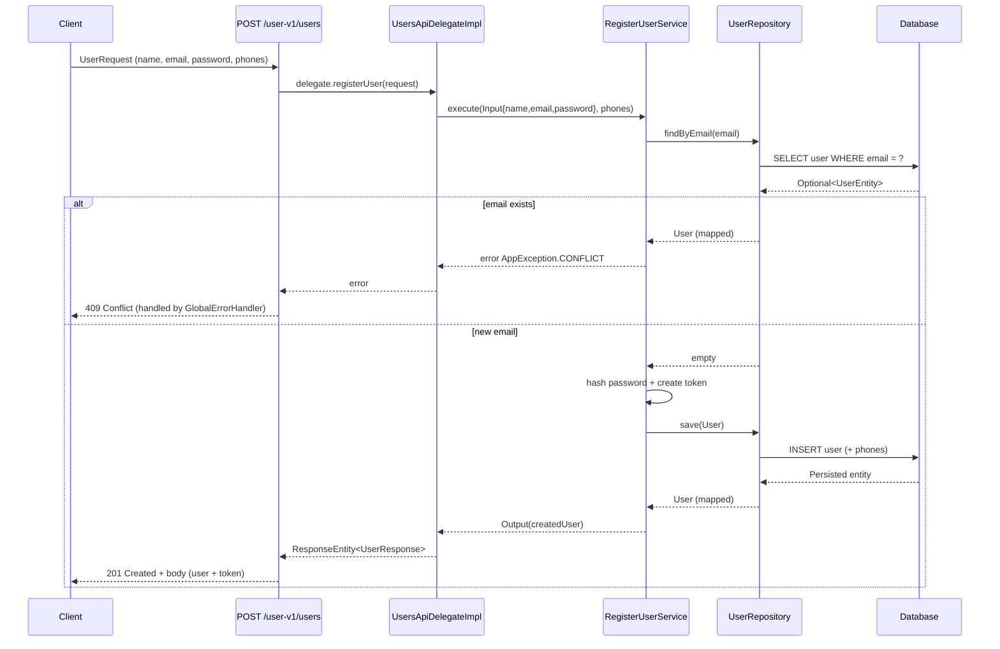

## User V1 API

- Java 21, Spring Boot 3 (WebFlux)
- OpenAPI Generator (delegate pattern)
- JWT (RS256)

### Endpoint diagram: Register user



## How to run

Port: 8080 (see `application.yml`).

Build and run (Windows PowerShell):

```powershell
.\mvnw.cmd clean package
.\mvnw.cmd spring-boot:run
```

## API endpoints

- POST /user-v1/users — Register a user. Returns 201 with the created user and JWT token.

OpenAPI

- Spec: `src/main/resources/openapi/api.yaml`
- UI: http://localhost:8080/webjars/swagger-ui/index.html

## Configuration

- Password policy: `app.password.regex` (see `application.yml`)
- Logging level: `logging.level.com.nisum.user`
- JWT: RS256. Keys at `jwt.rs256.*` (PEM strings in `application.yml`).

## Testing

```powershell
.\mvnw.cmd -DskipTests=false test
```

## Try it with curl

Windows PowerShell

```powershell
curl -X POST 'http://localhost:8080/user-v1/users' -H 'Content-Type: application/json' -H 'Accept: application/json' -d '{
  "name": "John Rodriguez",
  "email": "john@rodriguez.org",
  "password": "Lima2070$",
  "phones": [
    { "number": "1234567", "cityCode": "1", "countryCode": "57" },
    { "number": "987654321", "cityCode": "1", "countryCode": "51" }
  ]
}'
```

## H2 Console

URL: http://localhost:8082

Connection details (from `application.yml`)

- JDBC URL: `jdbc:h2:mem:usersdb;MODE=PostgreSQL;DB_CLOSE_DELAY=-1;DB_CLOSE_ON_EXIT=FALSE`
- Driver: `org.h2.Driver`
- User: `sa`
- Password: (empty)
